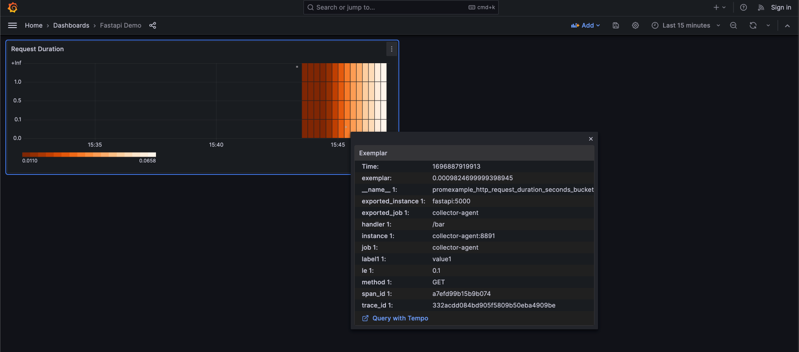
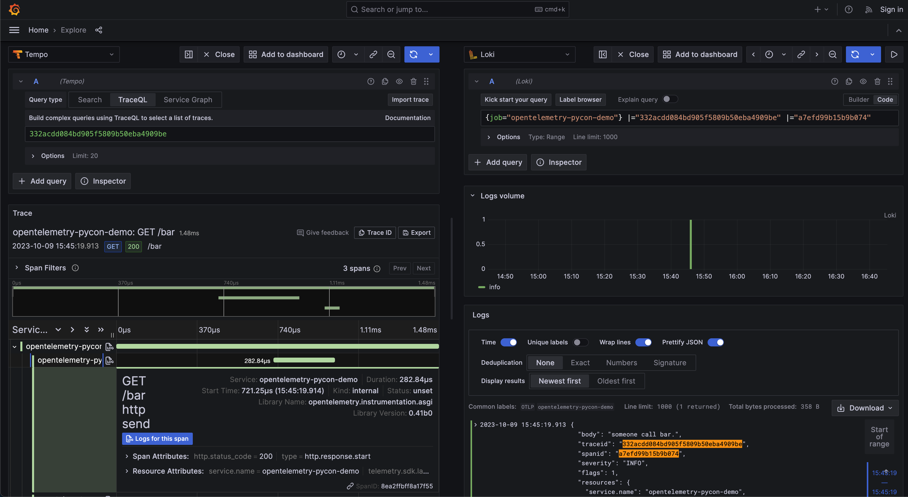

### Install docker-compose
```cmd
sudo apt-get install docker-compose-plugin
```


### Start Services with docker 
```cmd
docker compose build
docker compose up 
```
### Result
- Metric to Trace

- Trace to Log



### Reference:
- https://www.youtube.com/watch?v=dXR8WNm5uos&ab_channel=Grafana
- https://www.youtube.com/watch?v=UC09F-yGMG4&ab_channel=LinhVu
- https://github.com/nlinhvu/hello-service/blob/main/docker/collector/otel-collector.yml
- https://github.com/open-telemetry/opentelemetry-collector-contrib/blob/main/exporter/lokiexporter/example/otelcol.yaml
- https://grafana.com/docs/loki/latest/setup/install/docker/
- https://github.com/blueswen/fastapi-observability/tree/main